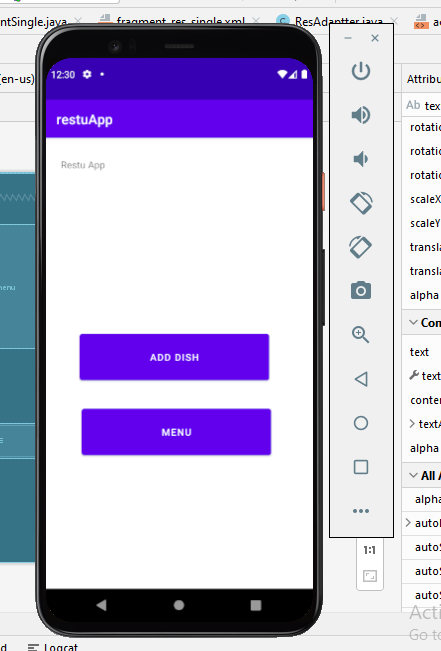
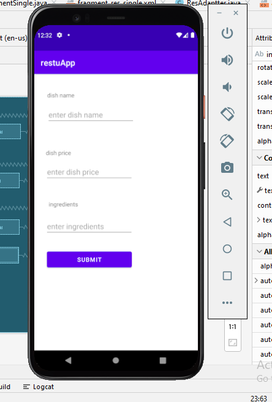
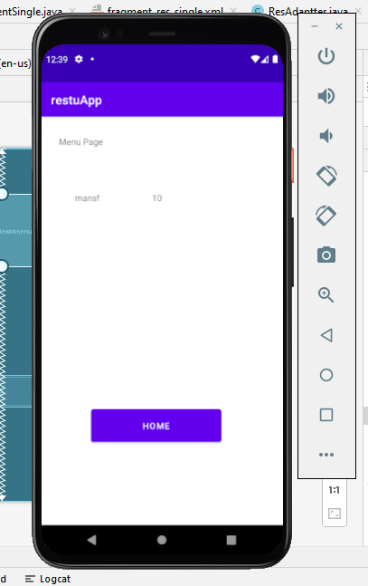
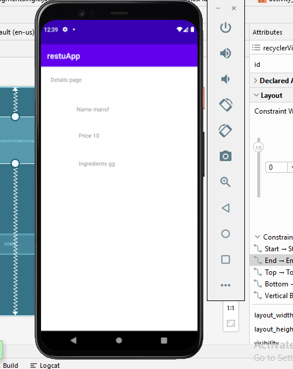

# restuApp
### App description:
1. Screen 1:
The screen that the user sees once the application is launched. contains two buttons, each leading to the specified activity.

2. Add dish screen:
The screen that shows when add dish button is clicked in screen 1
The user can add a dish with a name, price and ingredients, when submitted, the added dish should be persisted to the local DB (room).

3. Menu screen:
The screen that shows when menu button is clicked in screen 1
The screen shows the list of added dishes, each element in the view only shows the name and the price, when clicked, will navigate the user to dish details screen, that will display that dish's details (name, price and ingredients).

4. dish details screen
 that will display that dish's details (name, price and ingredients)

